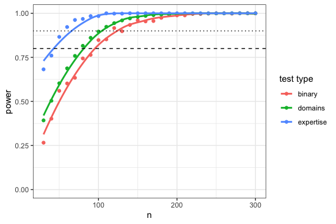

\pagenumbering{gobble}

# Figure 1. Power analysis for fieldwork sample sizes

To approximate appropriate sample sizes for structured surveys, we created a power curve by assuming medium effect sizes and simulating appropriate tests on binary and categorical responses (e.g., yes/no responses to questions about trust, efficacy, belief; categorical responses about knowledge and service domains associated with experts; "binary" and "domains", respectively) and Wilcoxon rank-sum tests on competence scores among experts vs. believers ("expertise"). Sample sizes are selected to approximate power $>0.8-0.95$ across tests. For more detail, see our [github repository](https://github.com/alightner/evoRelSci).

\newpage

# Table 1. Description of fieldwork predictions

Predictions are identified ("predict id") in support of various relevant hypotheses and a plainly stated prediction, based largely on binary and categorical data from structured surveys (phase 1) and competence scores (phase 2). For brevity, we use the notational format "$X \sim Y$" to abbreviate, "$X$ is associated with $Y$". Specified support criteria for each prediction is listed in table 2.

\begin{center}
\def\arraystretch{1.25}%
  \begin{tabular}{l l l}
  \hline
  \textbf{predict id} & \textbf{relevant hypotheses} & \textbf{prediction} \\ [0.5 ex]
  \hline
  1 & i & laibon prophets $\sim$ social conflict (SC) \\
  
  2 & i&science advisors $\sim$ economic challenges (EC) \\
  
  3 &i,ii& each local expert $\sim$ unique problem domains (U)  \\
  4 & i,ii&overlapping problem domains (O) $\sim$ high conflict, low consensus  \\

  5 &i,ii &science advisors (agricultural sciences) $\sim$ low herd size (TLU) \\
  6 &i,ii &science advisors (medicine) $\sim$ novel diseases (ND)  \\
  7 &i,ii &science advisors (medicine) $\sim$ access to medicine  \\
  8 &i,ii &laibon healers $\sim$ common diseases (CD)  \\
  9 &i,ii &laibon healers $\sim$ low access to medicine \\
  
  10 & ii &individual trust in experts $\sim$ local consensus (neighbors) about trust \\
  11 & ii&each expert is highly important in trust network  \\
  12 &i,iii& laibon healers $\sim$ plant knowledge (PK)  \\
  13 &i,iii &expert problem domains $\sim$ high knowledge in problem domain \\
  \end{tabular}
\end{center}

\newpage

# Table 2. Specified support criteria for fieldwork predictions

Specified support criteria for each prediction ("predict id") described in table 1. Several abbreviations are specified in each corresponding prediction in table 1, and for local experts (Lexp), LP: laibon prophet, LH: laibon healer, and SA: science advisor. Several predictions are based largely on binary and categorical data from structured surveys, and therefore contain conditional probabilities about experts and problem domains. 

For example, $Pr(LP=1|SC=1)>Pr(LP=0|SC=1)$ reads, "given the presence of a social conflict ($SC=1$), the probability of identifying a service from a laibon prophet ($LP=1$) will be greater than that of an expert who is not a laibon prophet ($LP=0$)". Analyses listed also include response variance about trust in overlapping vs. unique expertise in problem domains ($\sigma_O$ vs. $\sigma_U$), TLU (tropical livestock units), distance from a medical provider ($\ell$), individual trust ($t$), network degree ($k$) and betweenness centrality ($C_B$), and domain-specific competence score ($\lambda$).

\renewcommand*{\arraystretch}{1.25}
  \begin{tabular}{l l}
  \hline
  \textbf{predict id} & \textbf{support criteria} \\ [0.5 ex]
  \hline
  1 & $Pr(LP=1|SC=1)>Pr(LP=0|SC=1)$ \\
  
  2 & $Pr(SA=1|EC=1)>Pr(SA=0|EC=1)$ \\
  
  4 & $\sigma_O > \sigma_U$ (trust responses) \\
  
  5 & $Pr(SA=0) \sim TLU$  \\
  6 & $Pr(SA=1|ND=1) > Pr(SA=1|ND=0)$ \\
  7 & $Pr(SA=0) \sim \ell$ \\
  8 & $Pr(LH=1|CD=1) > Pr(LH=1|CD=0)$ \\
  9 & $Pr(LH=1) \sim \ell$ \\
  
  10 & $Pr(t=1) \sim \frac{k=1}{k}$ \\
  11 & $C_{B_{Lexp}} > \overline{C}_B$, $k_{Lexp} > \overline{k}$  \\
  12 & $\lambda_{PK_{LH}} > \overline{\lambda}_{PK}$ \\
  13 & $\lambda_{Lexp} > \overline{\lambda}$, per domain \\
  \end{tabular}
  