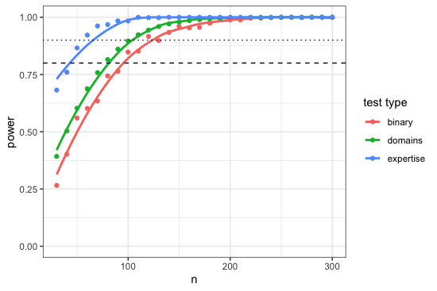
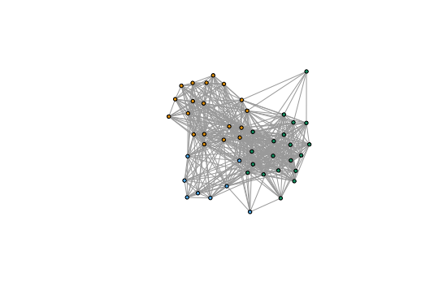
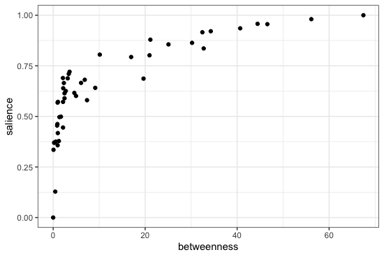
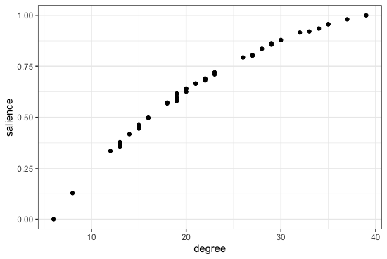
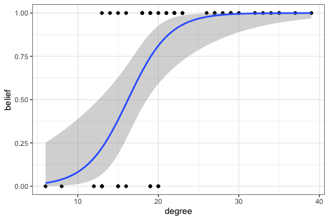

# Project: The Evolution of Religious and Scientific Beliefs as Coexisting Meaning Making Systems

This repo is dedicated to publishing materials for a project investigating the evolutionary origins of religious and scientific belief systems, carried out by PhD candidate Aaron Lightner and his PhD committee chair, Edward Hagen. In this project, are specifically examining the relationship between specialized expertise in religion and science (*experts*), and belief and deference to experts based on trust, efficacy, and authority (*believers*). Why are some people highly invested in knowledge and providing decision-making services for their communities? How and why do people in societies choose who to believe?

Our more detailed project proposal is linked in the PDF document, `LIGHTNER-subgrant-proposal.pdf`. The code can be viewed and the PDF regenerated in the Rmarkdown (`.Rmd`) file by the same name. All datasets used for preliminary, planned, and power analyses are in the `/datasets` folder, and plots are saved in the `/images` directory.

## Power analysis

Sample sizes in the fieldwork study, as described in the PDF project proposal, are based on a variety of specified test types that each assume medium effect sizes. In the `power-analysis.R` script, we simulated sample sizes and ran hypothetical experiments to generate a dataset, `power-analysis.csv`. In the R script `pwr_curve_plot.R`, this is used to generate the power curve for determining reasonable sample sizes in our fieldwork study:

Generating the power analysis dataset ahead of time saves you, dear reader, time spent on waiting for a simulation to run -- but if you are interested in making revisions and/or re-running and re-generating the `power-analysis.csv` dataset, you can go into `power-analysis.R` and uncomment the `write.table()` function (line 93), then re-run `pwr_curve_plot.R` to re-generate the power curve plot.

## Social network analysis script

It is difficult to anticipate social network structure prior to data collection. We therefore use the publicly available [Kenyan households contact network](http://www.sociopatterns.org/datasets/kenyan-households-contact-network/) as a working network structure to develop our data analysis plan. The dataset is a `.gml` file and its metadata, including optimal clustering labels that distinguish local modules (`netproperties.csv` and `cluster_members.csv`) are in the `/datasets` directory. The social network structure, with color-coded module clustering, is shown here:

To explore possible social influence on belief distribution, we used a simple simulation of idea transmission originating from a randomly selected "local expert" on the network. We refer to the number of times hearing the transmitted idea as *salience* and, for simplicity, assume that presence/absence of *belief* in the transmitted idea is influenced by the relative salience of the transmitted idea. These assumptions give us a working starting point to demonstrate some of our planned analyses. All manipulations, analyses, and simulations on the social network can be found in `social-network-data-script.R`, and plots are generated in `social-network-plots.R`.

To determine the influence of network structure and individual position on salience of the idea, we consider the impact of various centrality measures on *salience* and probability of believing widespread ideas (*belief* presence). For example, we expect that degree and betweenness centrality measures might be highly relevant to how exposed an individual is to a novel idea, and therefore how salient that idea would be:

Our analyses can also use a similar approach to analyzing the impact of network structure/individual position on binary presence/absence data about belief in a novel idea. For example, here we use a generalized linear model to predict probability of belief as a function of network degree:

